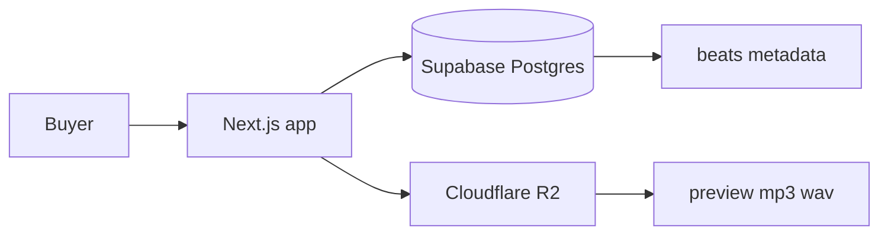

# Beat Store

Personal beat catalog for Jordan. Buyers browse tracks, play previews, and (later) check out with a lease or exclusive license.

Credit on every license: **Prod. by Jordan**.

## What we are building

A public storefront where a beat can be licensed two ways:

| License | Price | Files | Rights |
| --- | --- | --- | --- |
| Lease | $50 | MP3 + WAV | Non-exclusive, unlimited use |
| Exclusive | $199 | MP3 + WAV | Exclusive; beat leaves the catalog |

Producer keeps ownership and PRO royalty rights on both licenses. Exclusive sales set `is_exclusive_sold` so the beat is hidden from the catalog.

## Stack (now vs next)

**Now**

- **App:** Next.js (App Router) in this repo
- **Postgres:** Supabase project `web-store` (`beats`, `orders`, `settings` with RLS)
- **Audio:** Cloudflare R2 (not wired yet — old beat-store R2 keys were still placeholders)

**Next**

- Stripe guest checkout
- Watermarked 30-second previews
- Admin upload
- Vercel deploy
- Signed downloads after purchase



Metadata lives in Postgres. Audio files live in R2 (or, in local import mode, on disk via `/api/dev-audio`).

## Setup

1. Use the existing Supabase project named `web-store` (do not create another). Schema is already applied.
2. Copy env files and fill secrets:

```bash
cp .env.example .env.local
```

3. Create a Cloudflare R2 bucket named `beat-store`. Keep previews public later; keep full files private until signed download exists.
4. Install and run:

```bash
npm install
npm run dev
```

5. Free-tier Supabase projects pause after inactivity. Add a keep-alive ping later if that happens.

## Import old audio

There are ~186 files in `Documents/Music/beat migration`. Filenames usually start with BPM and key (`100 Bm Too Tough.mp3`). Choir/sample tracks are skipped.

Dry-run (no uploads, no database writes):

```bash
npm run import:beats -- --dry-run
```

Local previews (needs `SUPABASE_SERVICE_ROLE_KEY` and `BEAT_IMPORT_DIR` in `.env.local`):

```bash
npm run import:beats -- --local
```

That writes `.local-beat-sources.json` (gitignored) and points `preview_url` at `/api/dev-audio/{slug}`. Dev-only; not for production.

R2 upload (needs real R2 keys, not placeholders):

```bash
npm run import:beats -- --apply
```

Use `--limit 5` while testing. Watermarked 30s previews are not generated yet — `--apply` currently uploads the source file as both preview and full.

## Schema

### `beats`

| Column | Purpose |
| --- | --- |
| `id` | UUID primary key |
| `title`, `slug` | Display name; `slug` is unique and used in URLs and R2 paths |
| `bpm`, `key`, `genre`, `mood`, `tags` | Filterable metadata (`tags` is `text[]`) |
| `preview_url` | Public preview URL |
| `full_mp3_url`, `full_wav_url` | Paid-file locations (not public) |
| `lease_price`, `exclusive_price` | Defaults $50 / $199 |
| `is_exclusive_sold` | Hide from catalog after exclusive sale |
| `is_active` | Manual hide without deleting |
| `created_at`, `updated_at` | Timestamps |

### `orders`

Stripe purchase records for later. Kept in the first schema so checkout does not need a migration.

### `settings`

Store config: `producer_name` (default `Jordan`), default prices, optional watermark audio URL.

### Security

RLS is on for `beats`, `orders`, and `settings`.

- Public `SELECT` on `beats` where `is_active` and not `is_exclusive_sold`
- No public access to `orders` or `settings`
- Writes only through the service role

## R2 object layout

```
beats/{slug}/preview.mp3
beats/{slug}/full.mp3
beats/{slug}/full.wav
```

## Environment variables

See `.env.example`. Never commit real values.

- `NEXT_PUBLIC_SUPABASE_URL` and `NEXT_PUBLIC_SUPABASE_PUBLISHABLE_KEY` are safe in the browser.
- `SUPABASE_SERVICE_ROLE_KEY` and all `R2_*` secrets are server-only.

## License terms

**Lease ($50)** — Non-exclusive, unlimited use (streaming, performances, music videos). MP3 + WAV. Credit required: Prod. by Jordan.

**Exclusive ($199)** — Exclusive rights; beat is removed from the store. MP3 + WAV. Credit required: Prod. by Jordan. Producer still owns the composition and PRO royalties.
