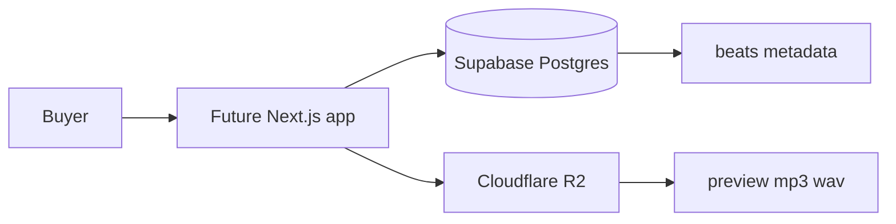

# Beat Store

Personal beat catalog for Jordan. Buyers browse tracks, play watermarked previews, and (later) check out with a lease or exclusive license.

This repo is the restart. **Right now there is no app code** — only this README, a Supabase project named `web-store`, and Cloudflare R2 for audio. Payments, admin, and deploy come next.

Credit on every license: **Prod. by Jordan**.

## What we are building

A public storefront where a beat can be licensed two ways:

| License | Price | Files | Rights |
| --- | --- | --- | --- |
| Lease | $50 | MP3 + WAV | Non-exclusive, unlimited use |
| Exclusive | $199 | MP3 + WAV | Exclusive; beat leaves the catalog |

Producer keeps ownership and PRO royalty rights on both licenses. Exclusive sales set `is_exclusive_sold` so the beat is hidden from the catalog.

## Stack (now vs next)

**Now**

- **Postgres:** Supabase project `web-store` (empty today; schema will be applied here)
- **Audio:** Cloudflare R2 (preview, full MP3, full WAV)
- **App:** not in this repo yet

**Next**

- Next.js storefront
- Stripe guest checkout
- Admin upload / catalog tools
- Vercel deploy
- Signed downloads after purchase

Do not bring FastAPI or Railway into this restart unless we decide we need them.



Metadata lives in Postgres. Audio files live in R2. The database stores public preview URLs and private full-file keys, not the bytes themselves.

## Setup (when we start coding)

1. Use the existing Supabase project named `web-store` (do not create another).
2. Apply the schema below in the SQL editor. Enable RLS on every public table **before** the anon key is used from a browser.
3. Create a Cloudflare R2 bucket. Keep previews publicly readable. Keep full MP3/WAV private until signed download exists.
4. Put secrets in local env files only. Never commit real keys.
5. Free-tier Supabase projects pause after inactivity. If that happens, add a keep-alive ping later — it is not in this repo yet.

## Intended schema

Reuse the three-table model from the earlier beat-store design. Apply it on `web-store`, not as a second source of truth.

### `beats`

Catalog rows. One row per track.

| Column | Purpose |
| --- | --- |
| `id` | UUID primary key |
| `title`, `slug` | Display name; `slug` is unique and used in URLs and R2 paths |
| `bpm`, `key`, `genre`, `mood`, `tags` | Filterable metadata (`tags` is `text[]`) |
| `preview_url` | Public R2 URL for the watermarked preview |
| `full_mp3_url`, `full_wav_url` | R2 locations for paid files (not public) |
| `lease_price`, `exclusive_price` | Defaults $50 / $199 |
| `is_exclusive_sold` | Hide from catalog after exclusive sale |
| `is_active` | Manual hide without deleting |
| `created_at`, `updated_at` | Timestamps |

### `orders`

Purchase records for Stripe later. Keep the table in the first schema so checkout does not require a migration.

| Column | Purpose |
| --- | --- |
| `id` | UUID primary key |
| `beat_id` | FK to `beats` |
| `license_type` | `lease` or `exclusive` |
| `buyer_email`, `buyer_name` | Guest checkout identity |
| `amount_paid` | Charged amount |
| `stripe_session_id`, `stripe_payment_intent` | Unique Stripe IDs |
| `download_token`, `download_expires_at`, `downloaded_at` | Time-limited delivery |

### `settings`

Single-row store config: `producer_name` (default `Jordan`), default lease/exclusive prices, optional watermark audio URL.

### Security

Enable Row Level Security on `beats`, `orders`, and `settings` as soon as the tables exist. Without RLS, the anon key can read and write every row. Typical first policies:

- Public `SELECT` on `beats` where `is_active` and not `is_exclusive_sold`
- No public access to `orders` or `settings`
- Writes only through a server role (service role or authenticated admin)

## R2 object layout

Convention for keys (not implemented yet):

```
beats/{slug}/preview.mp3
beats/{slug}/full.mp3
beats/{slug}/full.wav
```

`preview.mp3` may be served from a public R2 URL stored in `beats.preview_url`. `full.mp3` and `full.wav` stay private; the app will issue signed URLs after a paid order.

## Environment variables

Placeholders only. Fill these when the app exists. Never commit real values.

```env
NEXT_PUBLIC_SUPABASE_URL=
NEXT_PUBLIC_SUPABASE_ANON_KEY=
SUPABASE_SERVICE_ROLE_KEY=

R2_ACCOUNT_ID=
R2_ACCESS_KEY_ID=
R2_SECRET_ACCESS_KEY=
R2_BUCKET_NAME=
R2_PUBLIC_URL=
```

- `NEXT_PUBLIC_*` is safe in the browser (anon key + project URL).
- `SUPABASE_SERVICE_ROLE_KEY` and all `R2_*` secrets are server-only.

## License terms

**Lease ($50)** — Non-exclusive, unlimited use (streaming, performances, music videos). MP3 + WAV. Credit required: Prod. by Jordan.

**Exclusive ($199)** — Exclusive rights; beat is removed from the store. MP3 + WAV. Credit required: Prod. by Jordan. Producer still owns the composition and PRO royalties.
